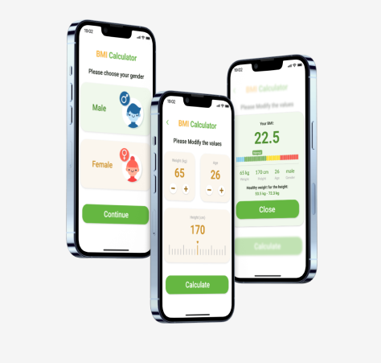

# BMI Calculator

# BMI Calculator App

  <table align="center">
    <tr>
      <td></td>
    </tr>
  </table>

A simple and clean **BMI Calculator App** built using **Flutter** and **Dart**.  
This project helps users calculate their Body Mass Index and track their health progress over time.

✅ BMI Calculation (Metric & Imperial units)  
✅ Instant Health Category Result  
✅ BMI History Tracking  
✅ Clean & Intuitive UI  
✅ Multi-language Support (EN / AR with RTL)  

---

## 📱 Features

### 1️⃣ BMI Calculator
- Enter height and weight in **Metric** (cm / kg) or **Imperial** (ft / lbs)
- Select **gender** and **age** for more accurate interpretation
- Instant BMI score calculation with color-coded result

### 2️⃣ Result Screen
- Displays your **BMI score** with visual indicator
- Health category label:
  - 🔵 Underweight — BMI < 18.5
  - 🟢 Normal weight — BMI 18.5 – 24.9
  - 🟡 Overweight — BMI 25 – 29.9
  - 🔴 Obese — BMI ≥ 30
- Short health tip based on your result

### 3️⃣ History
- View your **past BMI records** with date and time
- Track progress over time with a simple list view
- Delete individual records or clear all history

### 4️⃣ Settings & Preferences
- Switch between **Metric** and **Imperial** units
- Language switcher — **English / Arabic (RTL)**
- About screen with app info

---

## 🛠️ Tech Stack

| Layer | Technology |
|-------|------------|
| Framework | Flutter (Dart) |
| State Management | Provider / Riverpod |
| Local Storage | SharedPreferences / Hive |
| UI | Custom Widgets + Material Design |

---

## 🌍 Localization

The app supports two languages:

| Language | Code | Direction |
|----------|------|-----------|
| English  | `en` | LTR |
| Arabic   | `ar` | RTL |
